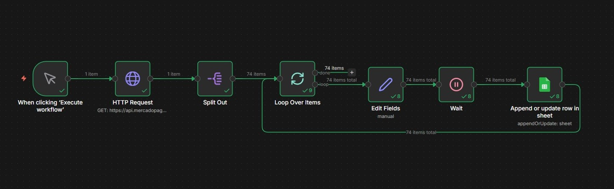
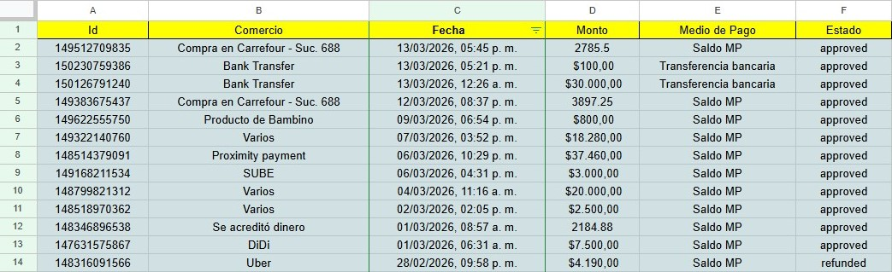

# 💸 Automatización de Gastos Personales con n8n y Mercado Pago

Sistema de finanzas personales automatizado que extrae, clasifica y registra todos los movimientos de Mercado Pago en Google Sheets sin intervención manual.

## 📸 Screenshots

### Flujo en n8n


### Resultado en Google Sheets


## 🎯 ¿Qué hace?

Cada vez que se ejecuta el flujo:
1. Se conecta a la API de Mercado Pago y trae los últimos 2 meses de transacciones
2. Procesa cada pago individualmente
3. Clasifica el medio de pago (transferencia bancaria, saldo MP, tarjeta, etc.)
4. Guarda cada transacción en Google Sheets sin duplicados
5. Mantiene un historial completo ordenado por fecha

## 🛠️ Tecnologías utilizadas

- **n8n** — plataforma de automatización low-code
- **Mercado Pago API** — fuente de datos de pagos
- **Google Sheets API** — almacenamiento y visualización
- **Google Cloud Console** — credenciales OAuth2

## 📊 Datos que registra

| Campo | Descripción |
|---|---|
| Id | ID único del pago en MP (evita duplicados) |
| Comercio | Nombre del comercio o tipo de pago |
| Fecha | Fecha y hora de la transacción |
| Monto | Importe en pesos |
| Medio de Pago | Transferencia bancaria, Saldo MP, tarjeta, etc. |
| Estado | approved, refunded, pending |

## 🔄 Arquitectura del flujo

```
Trigger manual
    ↓
HTTP Request (API Mercado Pago)
    ↓
Split Out (separa el array de pagos en items individuales)
    ↓
Loop Over Items (procesa de a uno)
    ↓
Edit Fields (mapea y transforma los campos)
    ↓
Wait (1 segundo - evita rate limit de Google Sheets)
    ↓
Google Sheets (Append or Update - sin duplicados por ID)
```

## ⚙️ Configuración

### Requisitos previos
- Cuenta en [n8n](https://n8n.io) (self-hosted o cloud)
- Cuenta de Mercado Pago con acceso a la API
- Cuenta de Google con Google Sheets y Google Drive API habilitadas

### 1. Credenciales de Mercado Pago
1. Ingresá a [Mercado Pago Developers](https://www.mercadopago.com.ar/developers)
2. Creá una aplicación
3. Copiá el **Access Token**
4. En n8n creá una credencial tipo **Header Auth** con:
   - Header Name: `Authorization`
   - Header Value: `Bearer TU_ACCESS_TOKEN`

### 2. Credenciales de Google
1. Creá un proyecto en [Google Cloud Console](https://console.cloud.google.com)
2. Habilitá **Google Sheets API** y **Google Drive API**
3. Creá credenciales OAuth2 (tipo Aplicación Web)
4. Agregá como URI de redirección: `http://localhost:5678/rest/oauth2-credential/callback`
5. En n8n creá una credencial **Google Sheets OAuth2**

### 3. Importar el workflow
1. Descargá el archivo `workflow.json`
2. En n8n: **Import from file**
3. Configurá las credenciales en cada nodo
4. Creá tu Google Sheet con estas columnas en la fila 1:

```
Id | Comercio | Fecha | Monto | Categoria | Medio de Pago | Estado
```

### 4. Configurar el Google Sheet en el nodo
En el nodo **Append or update row in sheet**:
- Document: seleccioná tu archivo
- Sheet: Hoja 1
- Mapping: Map Automatically
- Column to match on: Id

## 📈 Próximas mejoras

- [ ] Clasificación automática con GPT (comida, transporte, ocio, servicios)
- [ ] Dashboard en Google Sheets con gráficos por categoría
- [ ] Trigger automático programado (cada semana)
- [ ] Alertas por email cuando se supera un límite de gasto mensual

## 🔒 Seguridad

Este repositorio **no contiene** ninguna credencial ni token. Todos los secretos se configuran directamente en n8n y nunca se exportan en el archivo del workflow.

## 🚀 Aprendizajes del proyecto

- Consumo de APIs REST con autenticación Header Auth
- Manejo de estructuras JSON anidadas (arrays dentro de objetos)
- Uso de expresiones JavaScript dentro de n8n
- Manejo de rate limits de APIs (Google Sheets: 60 req/min)
- Deduplicación de registros usando ID único como clave
- OAuth2 con Google Cloud Console
- Transformación y normalización de datos con Edit Fields

---

Desarrollado como parte de un proyecto de automatización personal con n8n.
